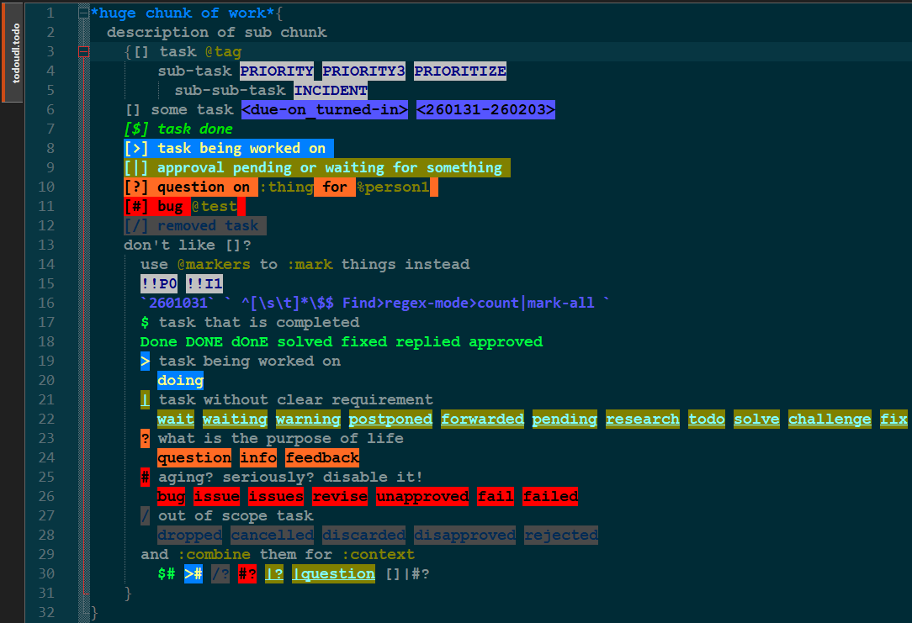
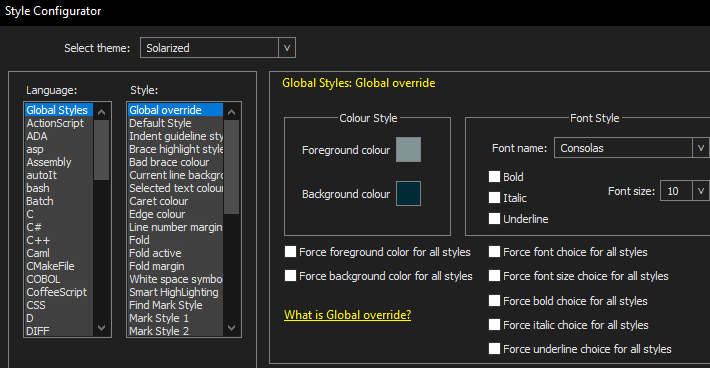
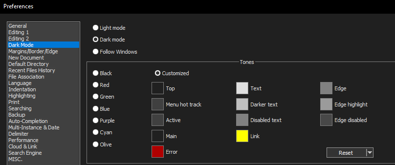

# npp-todo-solarized-dark-udl
KISS zealot's todo

npp with [UDL](https://npp-user-manual.org/docs/user-defined-language-system/) file and Voila!

# FAQ

**why**

( long rant about todo-lists, productivity, simplicity, data-ownership and FOSS )

**It doesn't look the same on my end**

